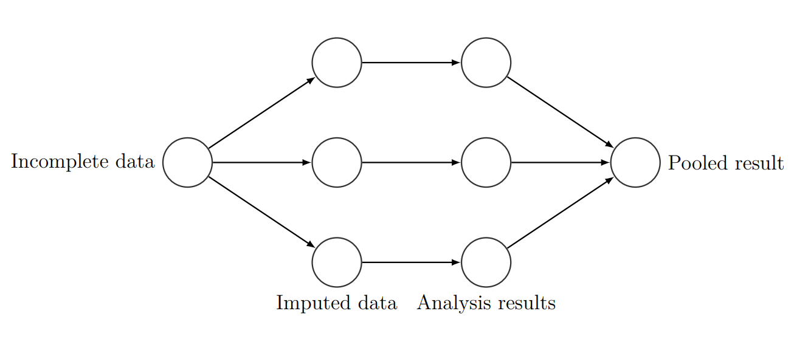
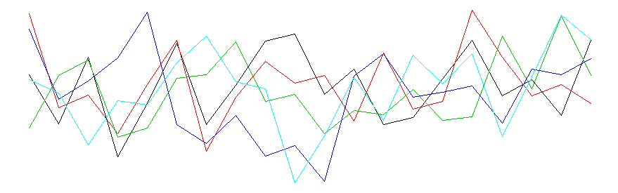

```{r setup, include=FALSE}
library("mice")
library("magrittr")
library("DT")
library("plotly")
library("dplyr")
library("ggplot2")
library("ggpubr")

load("C:/Users/User/Desktop/shinyMice/Simulation/Results/final.Rdata")
```

<!-- ## Disclaimer -->

<!-- This presentation only serves the illustrative purpose of showing that I am able to create a presentation in R Markdown. -->

## This presentation | and the entire research archive is available on: 

<center>
[github.com/gerkovink/ShinyMICE/](https://github.com/gerkovink/ShinyMICE/)
</center>
<br><br><br>
You can find all related materials, links and references there. 

## Content of the Presentation

<div class="columns-2">


<br><br><br>

- Introduction
- Methodology
- Simulation Results
- Discussion
</div>

# Introduction

## Multiple imputation
- Missing data is ubiquitous [@alli02]. 
- *Ad hoc* solutions may yield invalid inferences [@buur18].
- @rubin87 proposed the framework of MI.

## Multiple imputation
<br><br>

<center>

</center>


## Algorithmic convergence
<br><br>

<center>

<br>

<!-- Iteration number -->
</center>

# Methodology

## Mock code
```{r eval=FALSE}
simulation <- function() {
  mvtnorm(X,Z1,Z2) %>% 
  mutate(Y~X+Z1+Z2) %>% 
  for (max_iterations in 1:100) {
    ampute() %>% 
    impute() %T% 
    convergence_diagnostics %>% 
    lm(Y~X+Z1+Z2) %>% 
    pool %>% 
    simulation_diagnostics %>% 
    c(., convergence_diagnostics)
  }
}

replicate(simulation, n = 1000)
```


# Simulation Results

## Results 

<center>

<br>

</center>


## Results | simulation diagnostics versus convergence diagnostics

```{r echo=FALSE}
dat %>% select("It.", "bias", "CIW", "cov", "R_mean_X", "AC_mean_X") %>% round(3) %>% datatable(options = list(pageLength = 5), rownames = FALSE)
```

## Inspect the autocorrelation dip
```{r echo=FALSE}
dat %>% round(3) %$%  plot_ly(x = It., y = AC_mean_X, 
        text = paste("R hat: ", R_mean_X),
        type = "scatter", mode = "lines") %>% 
  layout(#title = "Auto-correlation across iterations",
         xaxis = list(title = "Nr. of iterations"),
         yaxis = list(title = "Auto-correlation (at lag 1)"))
```

# Discussion

## Discussion
<center>

</center>


<center>

</center>

## Impression of ShinyMICE
<center>
<br>


</center>

## Inspect $\widehat{R}$
```{r echo=FALSE}
dat %>% round(3) %$%  plot_ly(x = It., y = R_mean_X, 
        text = paste("AC: ", AC_mean_X),
        type = "scatter", mode = "lines") %>% 
  layout(#title = "R across iterations",
         xaxis = list(title = "Nr. of iterations"),
         yaxis = list(title = expression(paste(widehat(R)))))

```


## Inspect autocorrelation
```{r echo=FALSE}
dat %>% round(3) %$%  plot_ly(x = It., y = AC_mean_X, 
        text = paste("R hat: ", R_mean_X),
        type = "scatter", mode = "lines") %>% 
  layout(#title = "Auto-correlation across iterations",
         xaxis = list(title = "Nr. of iterations"),
         yaxis = list(title = "Auto-correlation (at lag 1)"))
```

## Equations $\widehat{R}$
\[\begin{align}
B&=\frac{T}{M-1} \sum_{m=1}^{M}\left(\bar{\theta}^{(\cdot m)}-\bar{\theta}^{(\cdot \cdot)}\right)^{2}, \quad \text{where} \quad \bar{\theta}^{(\cdot m)}=\frac{1}{T} \sum_{t=1}^{T} \theta^{(t m)}, \\
&\quad \text{ and } \quad \bar{\theta}^{(\cdot \cdot)}=\frac{1}{M} \sum_{m=1}^{M} \bar{\theta}^{(\cdot m)} \\
W&=\frac{1}{M} \sum_{m=1}^{M} s_{j}^{2},  \quad \text{where} \quad s_{m}^{2}=\frac{1}{T-1} \sum_{t=1}^{T}\left(\theta^{(t m)}-\bar{\theta}^{(\cdot m)}\right)^{2}  \\

\widehat{R}&=\sqrt{\frac{\widehat{\operatorname{var}}^{+}(\theta | y)}{W}},
\quad \text{where} \quad \widehat{\operatorname{var}}^{+}(\theta | y)=\frac{N-1}{N} W+\frac{1}{N} B.
\end{align}\]

<center>

</center>

## References
